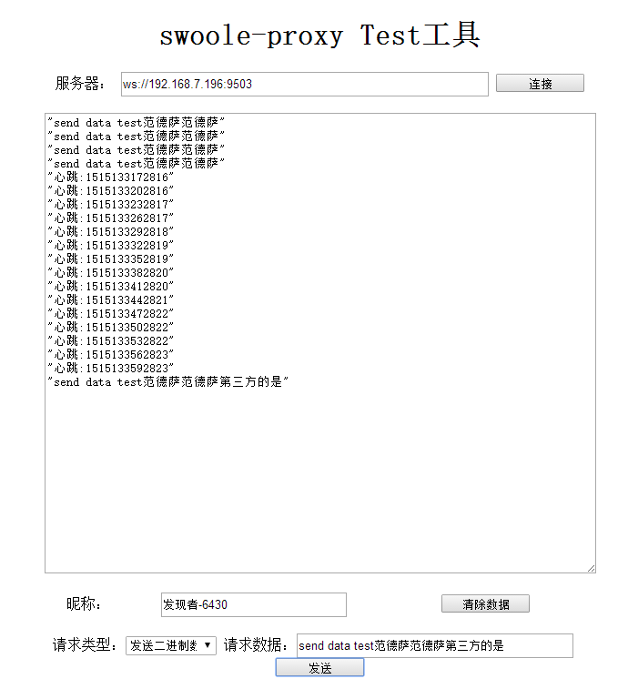

# swoole-chat

* 小试牛刀，swoole实现简单聊天室功能

## 一，概述

* 用swoole简单开发聊天服务器逻辑，兼容低端浏览器不支持websock服务器，客户端采用flash_websocket来兼容。
 
## 二，示例图



 
## 三，使用

* 配置服务器redis连接，消息存redis里

服务器启动：

```
php Chat.php                启动聊天服务
php FlashPolicy.php         启动flash客户端安全策略服务器

```

备注：FlashPolicy.php服务器提供flash_websocket安全策略使用， 只有不支持websocket浏览器会用到

客户端：

浏览器牌chat.html文件, 记住后面带上参数name=xxx,随便填写，例如：http://192.168.7.196/myswoole/chat/chat.html?name=bbb
        

## 四，联系方式

* qq：251413215
